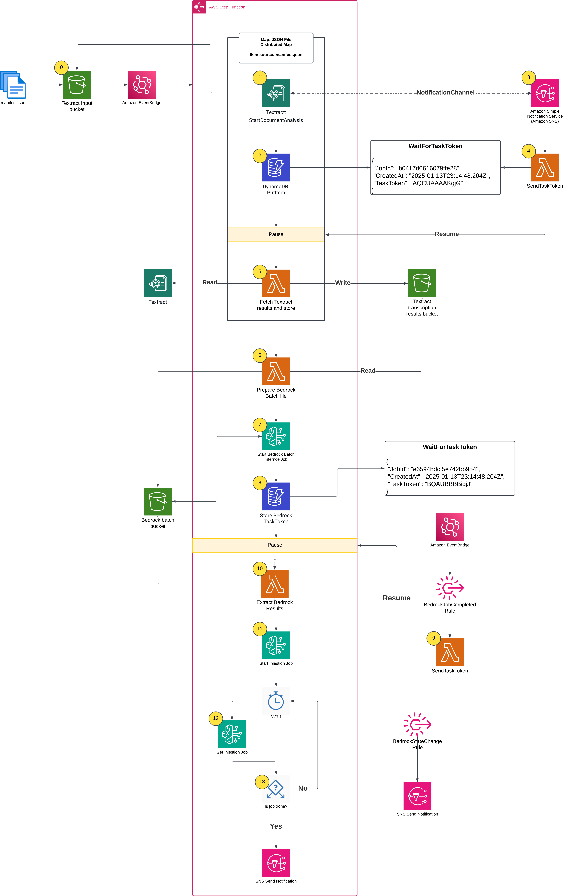
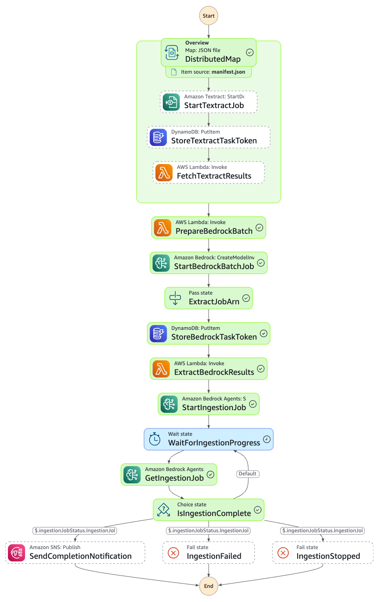

# Orchestrating large-scale document processing with AWS Step Functions and Amazon Bedrock batch inference

This solution demonstrates an automated, serverless pipeline for processing large document collections at scale. It extracts text from PDFs using Amazon Textract, generates structured metadata with Amazon Bedrock batch inference (50% cost savings), and loads everything into an Amazon Bedrock Knowledge Base for RAG applications.

## Architecture

The pipeline uses AWS Step Functions Distributed Map to process documents in parallel with Amazon Textract, then consolidates results for Amazon Bedrock batch inference. The extracted text and metadata are loaded into a searchable knowledge base using Amazon Bedrock Knowledge Bases with Amazon OpenSearch Serverless



## Downloading data

The workflow needs data to feed into it. In the accompanying blog post we wrote a small script to
download PDF papers from the Amazon Science page. You can do the same using
https://www.amazon.science/ or another source.

## CDK deployment

Once you have some data, deploy the infrastructure:

```bash
cd cdk-typscript
npm install
cdk deploy
```

There is one output that you'll need in the next step, which is the name of an S3 bucket where the
PDF inputs and manifest will go:

```
Outputs:
SFNBatchInference.BatchInputBucketName = sfnbatchinference-batchinputbucket40afe905-xyxasdfjkjjx
```

In this example, the papers are stored in the
`amazon_science_papers` directory, which you should adapt for your test:

```bash
cd amazon_science_papers
aws s3 sync . s3://sfnbatchinference-batchinputbucket40afe905-xyxasdfjkjjx
```

## Starting a job

Once you have files uploaded, create a `manifest.json` file and upload it into the same bucket. The
manifest file simply enumerates all of the files to be processed. The format will be like this:

```json
[
  {
    "filename": "flexecontrol-flexible-and-efficient-multimodal-control-for-text-to-image-generation.pdf"
  },
  {
    "filename": "adaptive-global-local-context-fusion-for-multi-turn-spoken-language-understanding.pdf"
  }
]
```

```bash
aws s3 cp manifest.json s3://sfnbatchinference-batchinputbucket40afe905-xyxasdfjkjjx
```

Once that file is copied, the Step Functions workflow will start. You can navigate to the Step
Functions console page to see the progress.



Note you update the `NOTIFICATIONS_EMAIL` array in the CDK code so that you receive email
notifications when the Bedrock batch inference job changes state.

```typescript
const NOTIFICATION_EMAILS: string[] = []
```

## Other useful CDK commands

- `npm run build` compile typescript to js
- `npm run watch` watch for changes and compile
- `npm run test` perform the jest unit tests
- `npx cdk deploy` deploy this stack to your default AWS account/region
- `npx cdk diff` compare deployed stack with current state
- `npx cdk synth` emits the synthesized CloudFormation template

## Security

See [CONTRIBUTING](CONTRIBUTING.md#security-issue-notifications) for more information.

## License

This library is licensed under the MIT-0 License. See the LICENSE file.
